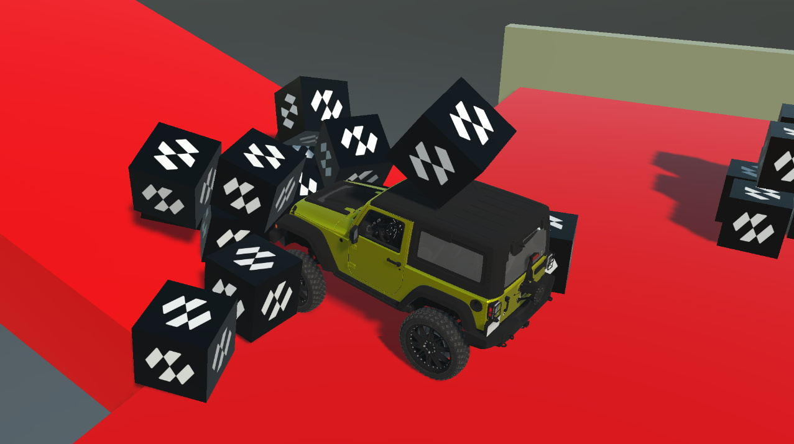
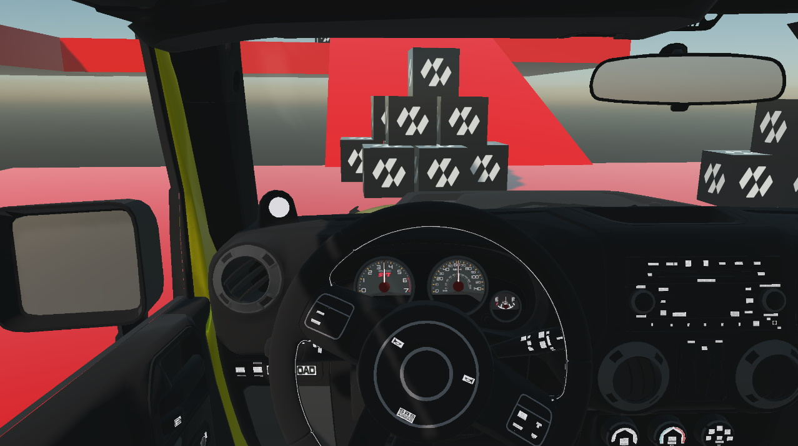

# Vehicle Physics  Sample

This sample shows how you can use Evergine to perform vehicle physics simulations that interact with other physics elements.

Model created by **[Maker Game Studios](https://sketchfab.com/MakerGamesStudios)** available in **[Sketchfab](https://sketchfab.com/3d-models/real-car-new-d90c7f830f9c41398bb55de4a2e001be)** and adapted for this application.

## Build and Run
- Required Visual Studio 2022 with .NET6 support

### How to use

            <li><strong>W,A,S,D or ← → ↑ ↓:</strong> Control the vehicle</li>
            <li><strong>Space: </strong>Brake the vehicle</li>
            <li><strong>C:</strong> Change camera</li>
            <li><strong>Enter, Tab: </strong>Reset the demo</li>

 * **W,A,S,D or ← → ↑ ↓:** Control the vehicle.
 * **Space**: Brake.
 * **C**: Change camera.
 * **Enter, Tab**: Reset the demo.
----
Powered by **[Evergine](https://evergine.com)**

LET'S CONNECT!

- [Youtube](https://www.youtube.com/channel/UCpA-X92rxM0OuywdVcir9mA)
- [Twitter](https://twitter.com/EvergineTeam)
- [News](https://evergine.com/news/)
